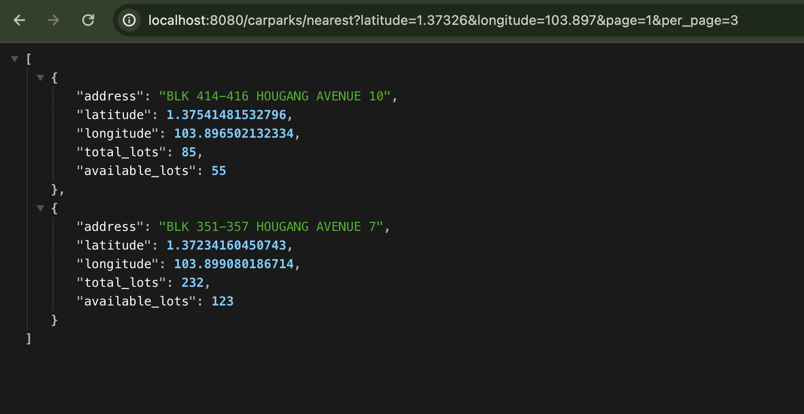
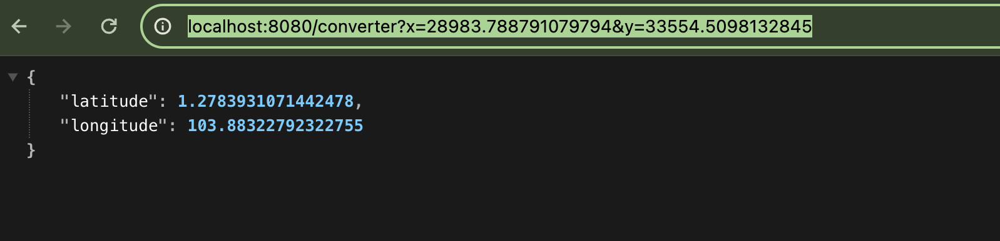

## Assignment notes
### Architecture
Assignment intent to use DDD and Hexagonal architecture
reference:

https://martinfowler.com/tags/domain%20driven%20design.html

https://en.wikipedia.org/wiki/Hexagonal_architecture_(software)

### Tech stack
Spring boot, Postgres, docker-compose, flyway

### How to start application
Run command below to start Postgres:

``docker-compose -f docker-compose.yml up --build``

Start application

``./gradlew bootRun``

Run API to find nearly car park

http://localhost:8080/carparks/nearest?latitude=1.37326&longitude=103.897&page=1&per_page=3

expected response:

Run API to update car park availability: http://localhost:8080/car-availability

Run API to convert Svy21 to WGS84: http://localhost:8080/converter?x=28983.788791079794&y=33554.5098132845

This API is calling to onemap API. Need to pass token to Authorization header. Please regis account to get token.

API doc: https://www.onemap.gov.sg/apidocs/apidocs

Expected response:

### References

SVY21 converter open source library: https://github.com/cgcai/SVY21/tree/master

Domain driven design: https://martinfowler.com/tags/domain%20driven%20design.html

Hexagonal architecture: https://en.wikipedia.org/wiki/Hexagonal_architecture_(software)

Haversine formula: https://en.wikipedia.org/wiki/Haversine_formula

### Further develop

Apply resilience: https://resilience4j.readme.io/docs/getting-started-3

